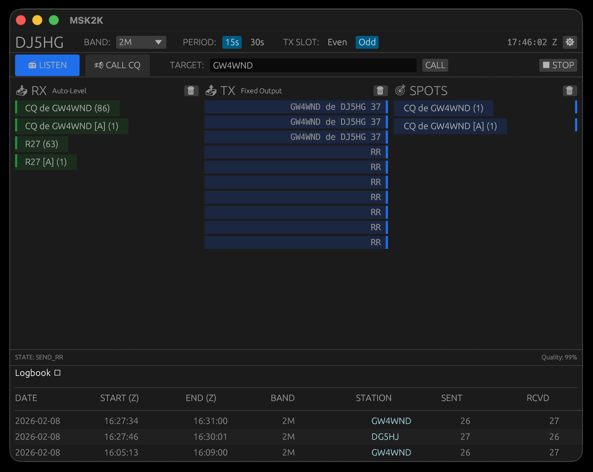

# MSK2K
**A Next-Generation Meteor Scatter Mode for Weak Signal DX**



## Overview
**MSK2K** is a specialized digital mode designed for amateur radio meteor scatter (MS) communication. It is a modern, high-performance evolution of the **PSK2k** protocol originally developed by Klaus von der Heide (DJ5HG).

While building upon the robust coding theoretical foundation of PSK2k, MSK2K introduces significant optimizations:
* **Modulation:** Transitioned from BPSK to **MSK (Minimum Shift Keying)** for constant envelope efficiency, allowing for higher average power output.
* **Architecture:** Completely rewritten in **Rust** for memory safety, high-speed concurrency, and true multi-platform support (Windows, Linux, macOS).The original imlementation of PSK2K relied on MATLAB being downloaded. Implementaion in RUST is completely self contained and extensively optimised.
* **Decoding:** Implements **Soft-Decision Viterbi Decoding** with **Deep Search Accumulation**, allowing it to decode signals buried deep in noise where traditional "hard decision" modes fail.

**Author:** Roger Banks (GW4WND)  
**Based on original development by:** Klaus von der Heide (DJ5HG)

---

## Why MSK2K? The Technical Advantage

### 1. MSK vs. PSK: Power Efficiency
The original protocol utilized **BPSK (Binary Phase Shift Keying)** While spectrally efficient, BPSK requires linear amplification to preserve amplitude variations during phase transitions. 
**MSK2K uses Minimum Shift Keying.** MSK is a constant-envelope mode. This allows transmitters to run at full saturation (Class C) without distortion. This is critical for meteor scatter, where maximizing average power output during short reflective bursts is paramount.

### 2. Soft Decoding vs. "Pass/Fail" (The MSK144 Difference)
Many common meteor scatter modes (like MSK144) rely on "Hard Decision" decoding. They look at a bit, decide instantly if it is a `1` or a `0`, and then try to assemble the message. If a ping is weak, fading, or fragmented, the decoder often fails to recover any data.

**MSK2K uses Soft-Decision Decoding:**
* **No Binary Decisions:** The receiver does not force a hard "1" or "0" immediately. Instead, it assigns a probability (a real-number "soft bit" value) to every sample based on the correlation magnitude.
* **Viterbi Magic:** These probabilities are fed into a **Viterbi Decoder**. This algorithm searches for the *most likely* valid path through the data trellis. It can mathematically reconstruct a valid message even if individual bits are corrupted by noise.

### 3. Accumulation: The "Deep Search"
Meteor scatter relies on ionized trails ("pings") that can be extremely short—sometimes shorter than a single packet.
* **Standard Modes:** Often discard partial packets.
* **MSK2K:** Uses **Accumulation**. It buffers the "soft energy" of multiple partial pings over a 15-second or 30-second period. It mathematically stacks these weak signals until they cross the decoding threshold.
* **Result:** You can complete QSOs using a series of micro-pings (or "broken" packets) that would be invisible to other decoders.

---

## How It Works: The Protocol Stack

The robustness of MSK2K comes from a sophisticated layering of error correction and detection derived from DJ5HG's original specification:

1.  **Convolutional Coding:**
    * **Inner Code:** Uses a Rate 1/2 Convolutional Code (Constraint Length 13) for standard messages and a Rate 1/9 Code for short messages. This redundancy allows the Viterbi decoder to bridge gaps caused by fading.
2.  **Interleaving:**
    * Data is scrambled (interleaved) across the packet structure. This ensures that a short noise burst does not wipe out contiguous data bits, protecting the integrity of the decoding path.
3.  **Parity Checks (The "Lock"):**
    * **Outer Code:** To prevent false decodes (a risk with sensitive soft decoding), MSK2K uses a rigorous **15-17 bit Parity Check** based on residual codes.
    * **The "Password":** The parity bits are often generated using the callsigns of *both* stations This means the decoder literally *cannot* produce a valid output unless the message is actually addressed to you (or is a valid CQ). It eliminates "ghost" decodes almost entirely.

---

## Usage: Semi-Automated QSO

MSK2K is designed to reduce operator fatigue while maintaining control over the contact.

1.  **Setup:** Enter your callsign and select your audio input/output devices in the Settings menu.
2.  **Calling CQ:** Click **"CALL CQ"**. The system will begin looping your CQ message.
3.  **The Auto-Sequence:**
    * When a station answers you, MSK2K automatically detects the caller.
    * It switches to **Report Mode** and sends signal reports (e.g., `GW4WND de DJ5HG 26`).
    * Upon receiving a report (R-Report), it switches to **Confirmation (RR)**.
    * Finally, it sends **73** and logs the contact to your ADIF file.
4.  **Monitoring:** Watch the UI for the **[A]** tag (e.g., `CQ de GW4WND [A]`). This indicates a decode was achieved via **Accumulation**—a contact that likely wouldn't have happened without this software's deep search capability.

---

## Installation & Building

### Prerequisites
MSK2K is built in **Rust** and is designed to be cross-platform.

* **Windows:** Works out of the box (uses WASAPI).
* **macOS:** CoreAudio supported natively.
* **Linux:** Requires ALSA development headers.
    ```bash
    sudo apt-get install libasound2-dev libudev-dev pkg-config
    ```

### Building from Source
```bash
git clone [https://github.com/GW4WND/MSK2K.git](https://github.com/GW4WND/MSK2K.git)
cd MSK2K
cargo build --release
./target/release/msk2k
